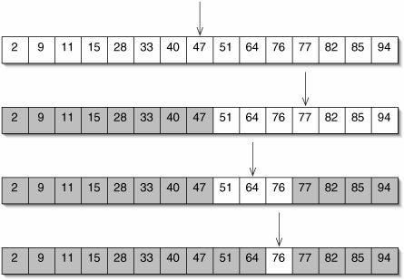
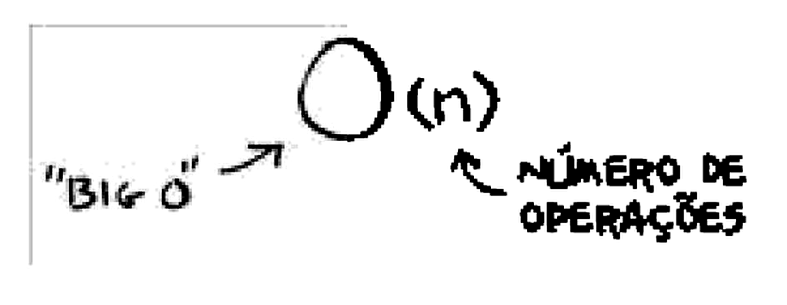
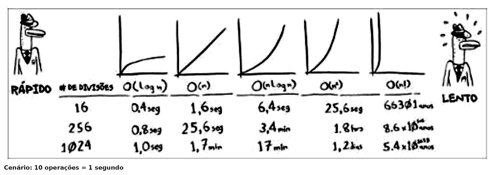
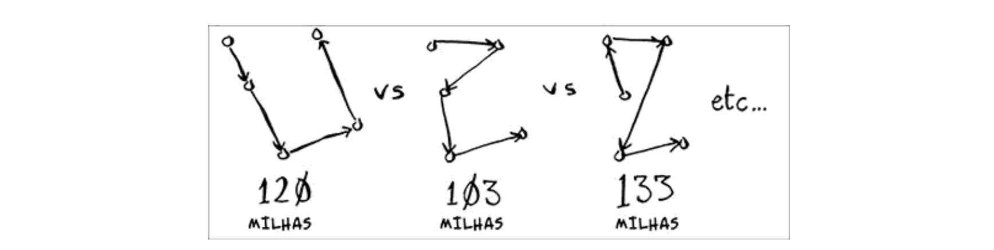

# Algoritmo

>"Um algoritmo é um conjunto de instruções que realizam uma tarefa."

Cada trecho poderia ser chamado de algoritmo, mas este livro trata dos trechos mais interessantes

 
# Pesquisa binária

A pesquisa binária é um algoritmo de busca. Sua entrada é uma lista ordenada de elementos. Ela funciona dividindo a lista ao meio, eliminando metade dos elementos contidos nela. Se o elemento que você está buscando estiver na lista, a pesquisa binária retorna a sua localização. Caso contrário, a pesquisa binária retorna None. O que mais impressiona é seu tempo de execução: no pior caso, ele é executado em tempo logarítmico, de modo que, para uma lista de tamanho 8, são necessárias apenas 3 operações, pois log₂ 8 é igual a 3.

**Exemplo em python:**
<a href="https://github.com/mayconct32/livro_entendendo_algoritmos/blob/main/Cap%201%20Introdu%C3%A7%C3%A3o%20a%20algoritmos/pesquisa_binaria.py">pesquisa_binaria.py<a/>

# Notação Big O

>"A notação Big O informa o quão rápido é um algoritmo. Por exemplo, imagine que você tem uma lista de tamanho n. O tempo de execução na notação Big O é O(n). Onde estão os segundos? Eles não existem - a notação Big O não fornece o tempo em segundos. A notação Big O permite que você compare o número de operações. Ela informa o quão rapidamente um algoritmo cresce."

**Alguns exemplos comuns de tempo de execução Big O:**

# O caixeiro-viajante

O caixeiro-viajante é um problema famoso da ciência da computação, pois seu crescimento é apavorante. O problema é o seguinte: o caixeiro quer passar por todas as cidades percorrendo uma distância mínima.

Ele soma a distância total de cada rota possível e escolhe o caminho de menor distância. Existem 120 permutações para cinco cidades; logo, precisa-se de 120 operações para resolver o problema, ou seja, o tempo de execução de um algoritmo para esse problema é O(n!). Você deve estar pensando: "De maneira alguma vou executar um algoritmo que tem tempo de execução O(n!)!" Mas, infelizmente, não temos uma forma melhor de resolvê-lo.
