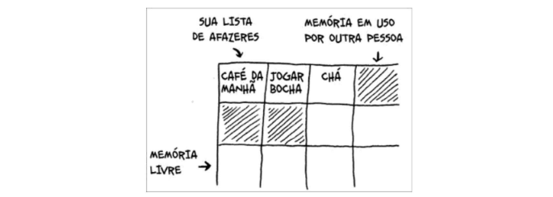
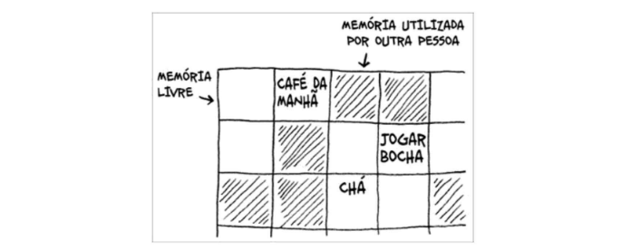
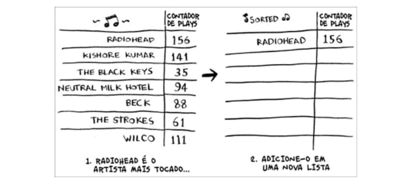
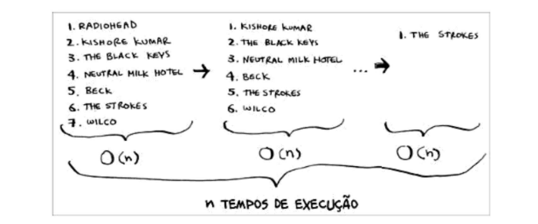

## Como funciona a memória

É como se a memória do computador fosse um grande conjunto de gavetas, e cada gaveta tem seu endereço. 
Cada vez que quer armazenar um item na memória, você pede ao computador um pouco de espaço e ele te dá um endereço no qual você pode armazenar o seu item. Se quiser armazenar múltiplos itens, existem duas maneiras para fazer isso: arrays e listas encadeadas.

 

## Arrays e listas encadeadas

Utilizar um array significa que todos os seus elementos estarão armazenados contiguamente (um ao lado do outro) na memória, sendo extremamente rápido para acessar de forma aleatória elementos indexados. Porém, se for necessário adicionar algum outro elemento e a próxima gaveta estiver ocupada, todos os elementos deverão se mover de lugar.

Já a lista encadeada é diferente, seus itens podem estar em qualquer lugar da memória, possibilitando uma inserção e eliminação de elementos de forma rápida, cada item armazena o endereço do próximo item da lista. Diversos endereços aleatórios de memória estão ligados. Porém, sua leitura é muito lenta, porque para acessar algum elemento, é necessário passar por todos os outros antes dele.

**Comparaçao em Notaçao Big O:**

 

## Ordenação por seleção

Ordenação por seleção, como o próprio nome já diz, é um algoritmo de ordenação. Seu funcionamento é simples: pegue o menor elemento de uma lista e adicione a uma nova lista, faça isso repetidas vezes e no final terá uma lista ordenada.

Seu tempo de execução é O(n x n) ou O(n^2), porque para cada um dos elementos, é necessário n operações.

>"conforme passa pelas operações, o número de elementos que precisa analisar diminui. Eventualmente, você acaba tendo de checar apenas um elemento. Então como o tempo de execução permanece sendo O(n^2)? Isto é uma boa pergunta, e a resposta tem a ver com a notação Big O. será falado mais sobre isso no capítulo 4."

**Implementação em python:**
<a href="">ordenacao_por_selecao.py</a>

